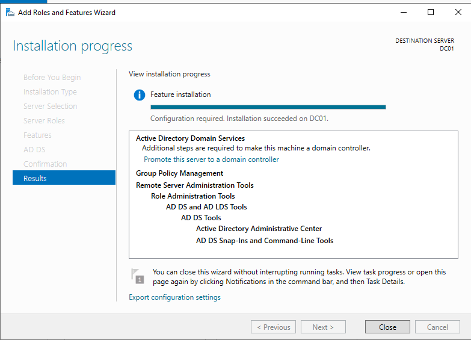

# Active Directory Domain Services Installation

## Objective

Install Active Directory Domain Services (AD DS) on Windows Server 2022.

## Activities Performed

- Opened Server Manager
- Added Active Directory Domain Services role
- Installed required management tools
- Verified successful installation

## Evidence

### AD DS Installation

## Outcome

The server is ready for domain controller promotion.