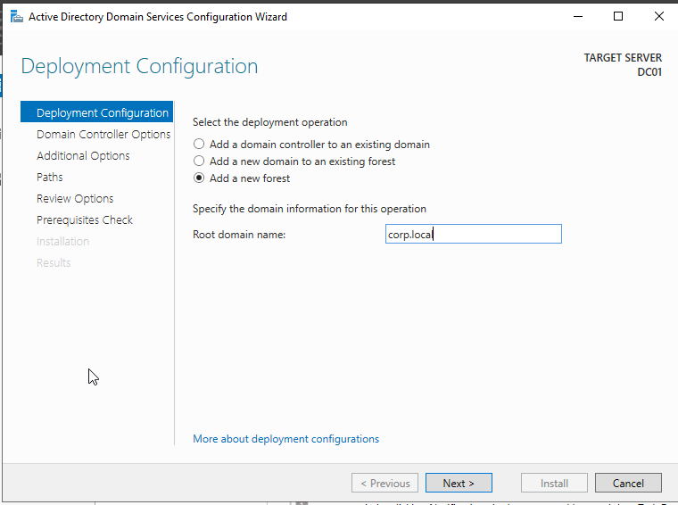
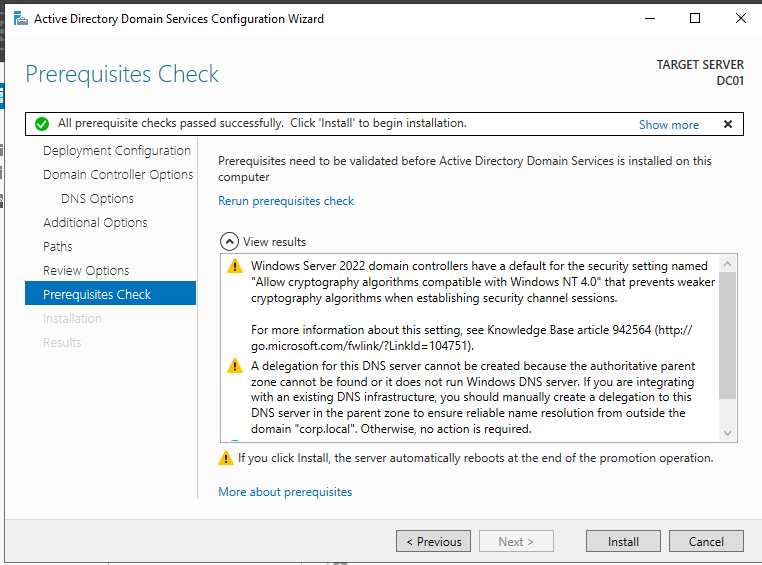
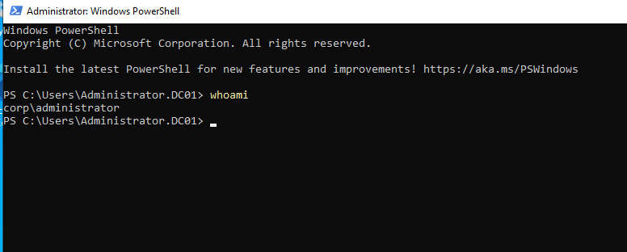

# Domain Creation

## Objective

Deploy a new Active Directory forest and promote the Windows Server 2022 system to a Domain Controller for centralized identity and access management.

---

## Configuration

| Setting | Value |
|----------|----------|
| Deployment Type | New Forest |
| Root Domain Name | corp.local |
| Domain Controller | DC01 |
| DNS Server | Installed |
| Global Catalog | Enabled |
| Forest Functional Level | Windows Server 2016 |
| Domain Functional Level | Windows Server 2016 |

---

## Activities Performed

- Opened Active Directory Domain Services Configuration Wizard
- Selected **Add a new forest**
- Configured root domain name as **corp.local**
- Configured Domain Controller options
- Enabled DNS Server role
- Enabled Global Catalog (GC)
- Configured Directory Services Restore Mode (DSRM) password
- Completed prerequisite validation checks
- Promoted the server to a Domain Controller
- Verified successful domain deployment after automatic reboot

---

## Verification

The domain deployment was verified by authenticating with the domain administrator account and executing the following command:

```powershell
whoami
```

Output:

```text
corp\administrator
```

This confirms that the server was successfully promoted to a Domain Controller and that the Active Directory domain was created successfully.

---

## Evidence

### Domain Deployment Configuration



### Prerequisite Validation



### Domain Verification



---

## Outcome

A new Active Directory forest named **corp.local** was successfully deployed and the server was promoted to a Domain Controller. Centralized authentication, authorization, DNS integration, and enterprise identity management services are now available for the lab environment.

---

## Skills Demonstrated

- Active Directory Domain Services (AD DS)
- Domain Controller Deployment
- DNS Integration
- Forest and Domain Configuration
- Identity and Access Management
- Windows Server Administration
- Infrastructure Deployment
- Enterprise Authentication Services