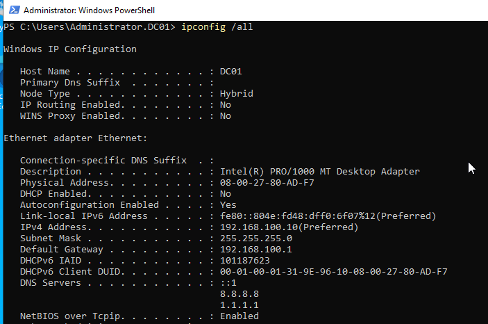
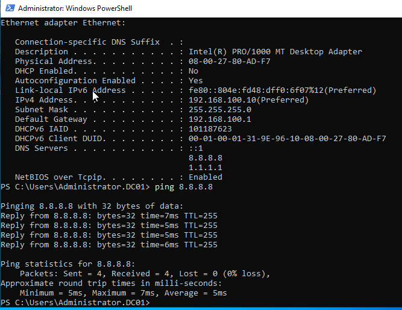

# Network Configuration

## Objective

Configure a static IPv4 address on the Windows Server 2022 system to provide consistent network connectivity and prepare the server for future infrastructure services.

---

## Configuration Details

| Setting         | Value          |
| --------------- | -------------- |
| IP Address      | 192.168.100.10 |
| Subnet Mask     | 255.255.255.0  |
| Default Gateway | 192.168.100.1  |
| Preferred DNS   | 8.8.8.8        |
| Alternate DNS   | 1.1.1.1        |

---

## Validation

Verified network connectivity using:

- ipconfig /all
- ping 8.8.8.8

Successful responses confirmed:

- Correct IP assignment
- DNS configuration
- Internet connectivity
- Network reachability

---

## Evidence

### IP Configuration Verification

---

### Connectivity Test

---

## Outcome

The server was successfully configured with a static IPv4 address and verified network connectivity. This provides a stable foundation for future infrastructure services including Active Directory, DNS, and Group Policy deployment.
