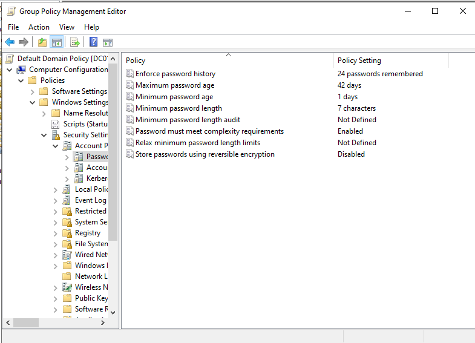
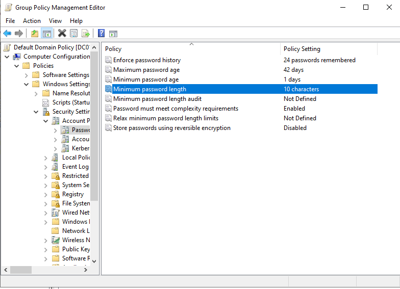
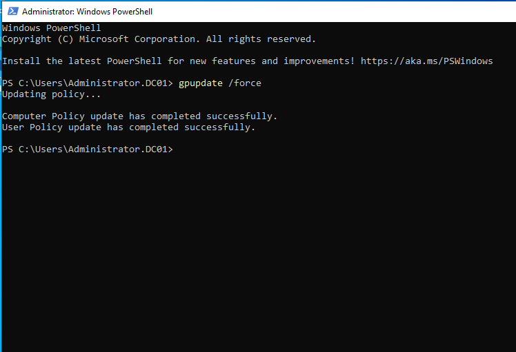
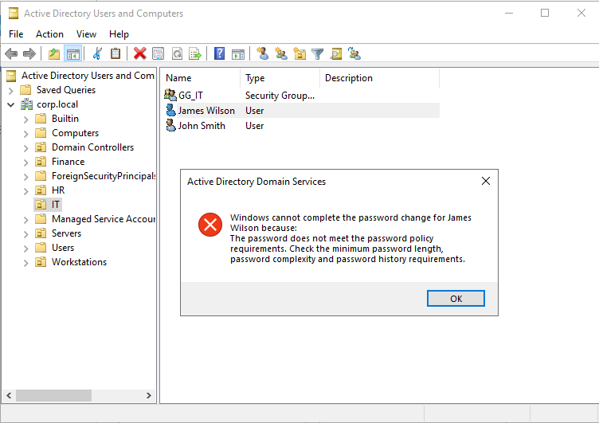
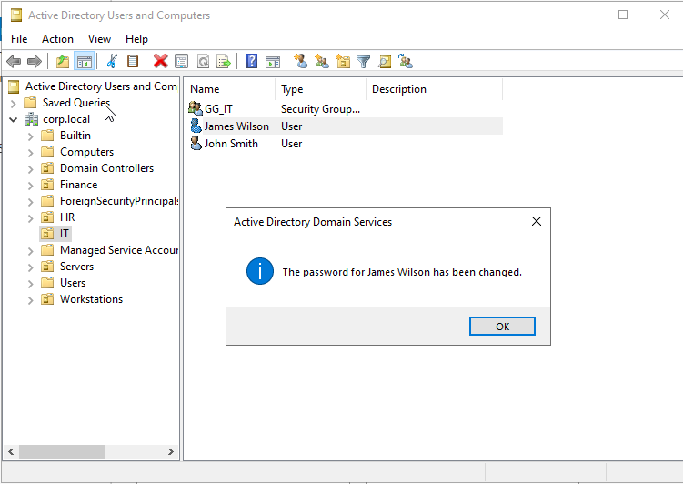

# HD-006 - Password Policy Enforcement

## Ticket Information

| Field | Value |
|---------|---------|
| Ticket ID | HD-006 |
| Category | Group Policy |
| Priority | High |
| Status | Resolved |
| Environment | Active Directory (corp.local) |

---

## Request

Management requested stronger password controls for all domain users to improve account security and reduce the risk of weak passwords.

Requirements:

- Enforce strong passwords
- Increase minimum password length
- Verify policy enforcement

---

## Investigation

Reviewed the existing Default Domain Policy.

Current configuration:

- Password history: 24 passwords remembered
- Maximum password age: 42 days
- Minimum password age: 1 day
- Minimum password length: 7 characters
- Password complexity: Enabled

---

## Resolution

Opened:

```text
Group Policy Management
→ Domains
→ corp.local
→ Default Domain Policy
→ Edit
```

Navigated to:

```text
Computer Configuration
→ Policies
→ Windows Settings
→ Security Settings
→ Account Policies
→ Password Policy
```

Modified:

```text
Minimum password length
7 → 10 characters
```

Retained:

```text
Password complexity = Enabled
Password history = 24
Maximum password age = 42 days
```

---

## Policy Deployment

Applied the updated policy using:

```powershell
gpupdate /force
```

Result:

```text
Computer Policy update has completed successfully.
User Policy update has completed successfully.
```

---

## Verification Testing

### Test 1 – Weak Password

Attempted password:

```text
Test123
```

Result:

```text
Password rejected
```

Error indicated the password did not meet policy requirements.

---

### Test 2 – Strong Password

Attempted password:

```text
Welcome2026!
```

Result:

```text
Password accepted
```

Password reset completed successfully.

---

## Evidence

### Original Password Policy



### Updated Password Policy



### Group Policy Update



### Weak Password Rejected



### Strong Password Accepted



---

## Outcome

Successfully strengthened the domain password policy and verified enforcement through real-world testing.

The environment now requires:

- Minimum password length of 10 characters
- Password complexity enabled
- Password history enforcement

Weak passwords are rejected and compliant passwords are accepted.

No further action required.

---

## Skills Demonstrated

- Group Policy Management
- Active Directory Administration
- Password Policy Configuration
- Security Hardening
- Policy Deployment
- Policy Verification
- Windows Server Administration
- Helpdesk Documentation