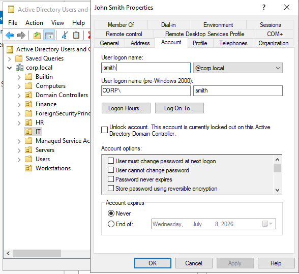
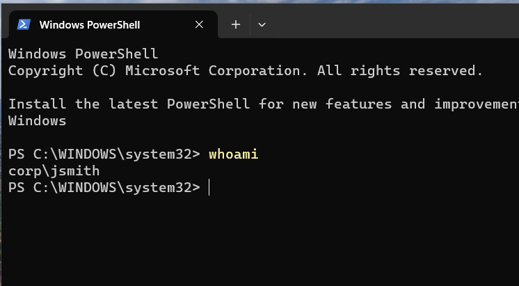

# Ticket 001 - User Account Locked Out

## Ticket Information

| Field       | Value                         |
| ----------- | ----------------------------- |
| Ticket ID   | HD-001                        |
| Category    | Account Management            |
| Priority    | Medium                        |
| Status      | Resolved                      |
| Assigned To | IT Support                    |
| Environment | Active Directory (corp.local) |

---

## User Report

User John Smith reported being unable to sign in to the corporate workstation after multiple failed login attempts.

Error displayed on workstation:

> "The referenced account is currently locked out and may not be logged on to."

---

## Investigation

### Initial Assessment

The issue was reproduced on workstation **WS01**.

Observed error message confirmed that the account had been locked due to repeated failed authentication attempts.

### Verification Steps

1. Opened Active Directory Users and Computers (ADUC).
2. Navigated to:

```text
corp.local
└── IT
    └── John Smith
```

3. Opened user properties.
4. Reviewed the **Account** tab.
5. Confirmed the account was locked.

Evidence:

```text
Unlock account.
This account is currently locked out on this Active Directory Domain Controller.
```

### Root Cause

The user exceeded the configured Active Directory Account Lockout Policy threshold.

Configured policy:

* Account Lockout Threshold: 5 invalid logon attempts
* Account Lockout Duration: 30 minutes
* Reset Account Lockout Counter After: 30 minutes

---

## Resolution

Performed the following actions:

1. Opened Active Directory Users and Computers.
2. Located the affected user account.
3. Opened Account Properties.
4. Selected:

```text
Unlock account
```

5. Applied changes.
6. Instructed the user to sign in again using the correct password.

---

## Verification

User successfully authenticated to the domain after account unlock.

Executed:

```powershell
whoami
```

Output:

```text
corp\jsmith
```

This confirmed:

* Account unlock successful
* Domain authentication successful
* Access restored

---

## Evidence

### Account Locked Out



### Account Unlock Confirmation



---

## Outcome

The user account was successfully unlocked and access to the domain was restored.

No further action required.

---

## Skills Demonstrated

* Active Directory Administration
* User Account Management
* Account Lockout Investigation
* Account Recovery Procedures
* Authentication Troubleshooting
* Helpdesk Ticket Documentation
* Windows Domain Environment Support
