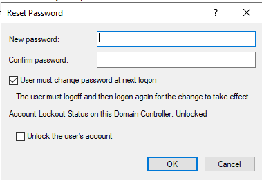
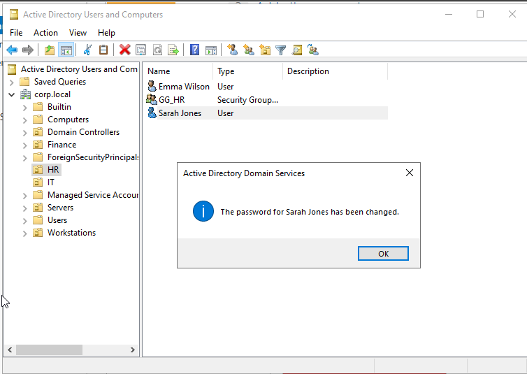
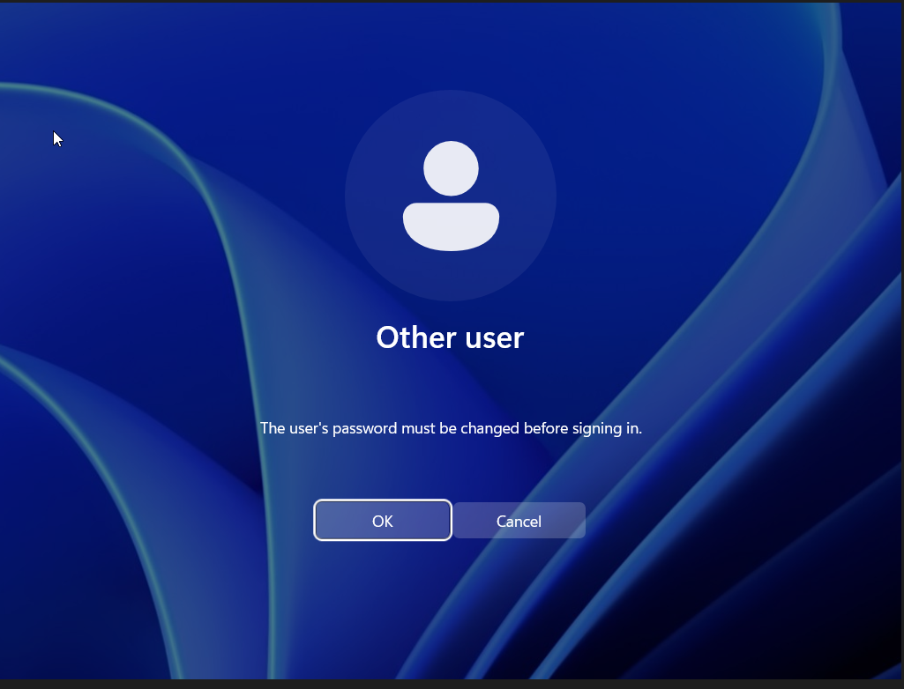
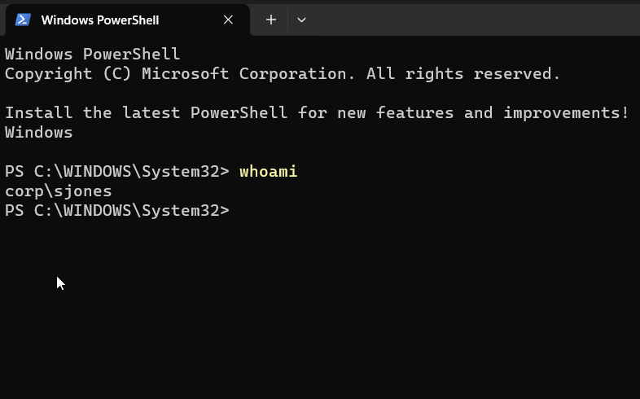

# Ticket 002 - Password Reset Request

## Ticket Information

| Field       | Value                         |
| ----------- | ----------------------------- |
| Ticket ID   | HD-002                        |
| Category    | Account Management            |
| Priority    | Medium                        |
| Status      | Resolved                      |
| Assigned To | IT Support                    |
| Environment | Active Directory (corp.local) |

---

## User Report

User Sarah Jones reported being unable to access her domain account because she had forgotten her password.

The user requested a password reset and assistance regaining access to corporate resources.

---

## Investigation

### Initial Assessment

Verified the user account existed within Active Directory and confirmed there were no account lockout issues.

User account:

```text
corp\sjones
```

Location:

```text
corp.local
└── HR
    └── Sarah Jones
```

---

## Resolution

Performed the following actions:

1. Opened Active Directory Users and Computers.
2. Located the Sarah Jones user account.
3. Selected:

```text
Reset Password
```

4. Assigned temporary password:

```text
TempPass123!
```

5. Enabled:

```text
User must change password at next logon
```

6. Communicated temporary credentials to the user.
7. User successfully authenticated.
8. User changed password during first login.

---

## Verification

The user successfully logged into the Active Directory domain after changing the temporary password.

Command executed:

```powershell
whoami
```

Output:

```text
corp\sjones
```

This confirmed:

* Password reset successful
* Password change completed
* Domain authentication successful
* User access restored

---

## Evidence

### Password Reset Request



### Temporary Password Assigned



### Password Change Prompt



### Successful Login Verification



---

## Outcome

The user account password was successfully reset and access to the domain environment was restored.

No further action required.

---

## Skills Demonstrated

* Active Directory Administration
* User Account Management
* Password Reset Procedures
* Identity Verification Workflow
* Authentication Troubleshooting
* Windows Domain Administration
* Helpdesk Ticket Documentation
