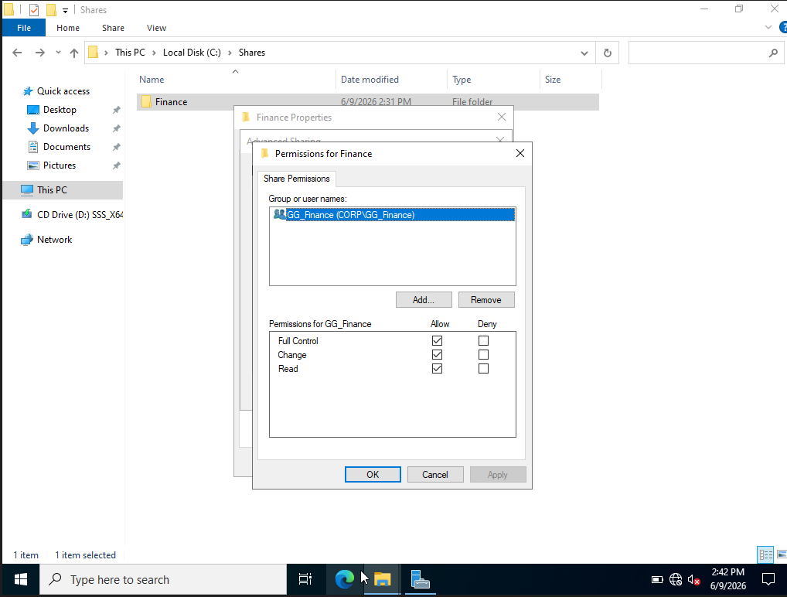
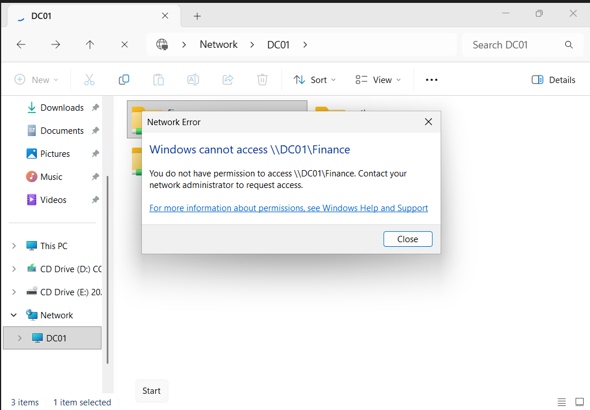
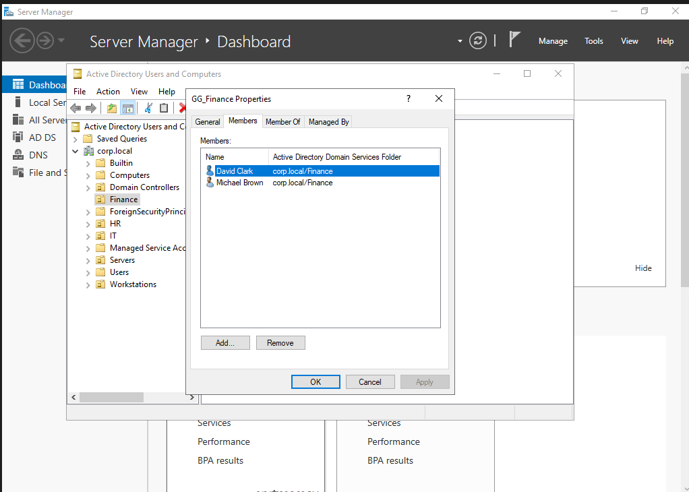
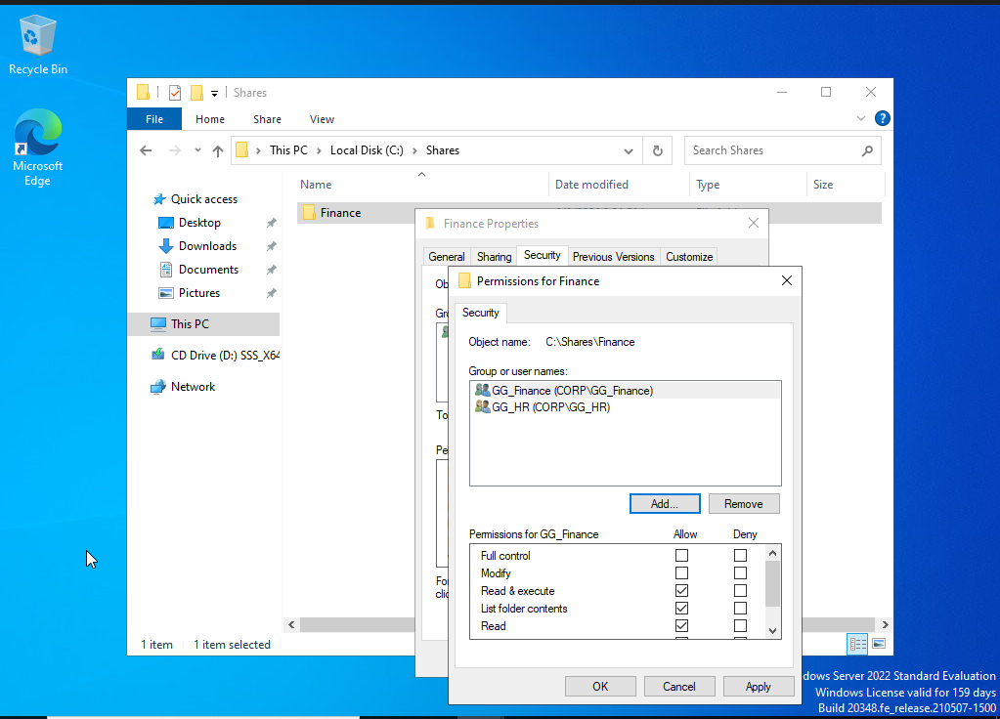
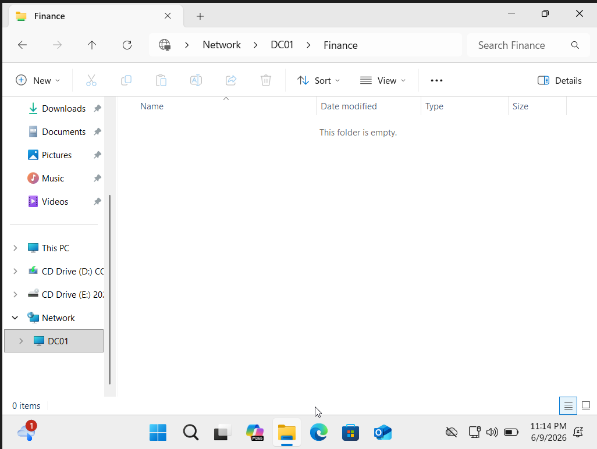

# Ticket 003 - Shared Folder Access Denied

## Ticket Information

| Field       | Value                         |
| ----------- | ----------------------------- |
| Ticket ID   | HD-003                        |
| Category    | File Share Access             |
| Priority    | Medium                        |
| Status      | Resolved                      |
| Assigned To | IT Support                    |
| Environment | Active Directory (corp.local) |

---

## User Report

User Michael Brown from the Finance department reported being unable to access the Finance shared folder.

Error displayed:

> Windows cannot access \\DC01\Finance

> You do not have permission to access \\DC01\Finance

---

## Investigation

### Initial Assessment

Verified the Finance share existed on the Domain Controller.

Location:

```text
C:\Shares\Finance
```

Share Name:

```text
\\DC01\Finance
```

---

### User Verification

Verified user account membership.

User:

```text
Michael Brown
```

Group Membership:

```text
GG_Finance
```

The user was correctly assigned to the Finance security group and should have access.

---

### Share Permissions Review

Verified share permissions:

```text
GG_Finance = Full Control
```

Share permissions were configured correctly.

---

### NTFS Permissions Review

Reviewed NTFS permissions on:

```text
C:\Shares\Finance
```

Identified that:

```text
GG_HR
```

had permissions assigned while:

```text
GG_Finance
```

was missing from NTFS permissions.

This prevented Finance users from accessing the folder despite having correct share permissions.

---

## Root Cause

Mismatch between Share Permissions and NTFS Permissions.

Share permissions allowed Finance users access, but NTFS permissions did not include the Finance security group.

---

## Resolution

Performed the following actions:

1. Opened Finance folder security settings.
2. Reviewed NTFS permissions.
3. Added:

```text
GG_Finance
```

4. Granted:

```text
Modify
Read & Execute
List Folder Contents
Read
Write
```

5. Applied changes.
6. Tested access using Finance user account.

---

## Verification

User Michael Brown successfully accessed:

```text
\\DC01\Finance
```

after permissions were corrected.

Access was restored without errors.

---

## Evidence

### Finance Share Created


### Share Permissions



### Access Denied Error



### Group Membership Verification



### Permissions Fixed



### Successful Access



---

## Outcome

The Finance security group was granted the appropriate NTFS permissions and user access was restored.

No further action required.

---

## Skills Demonstrated

- Active Directory Administration
- Security Group Management
- NTFS Permissions
- Share Permissions
- Access Troubleshooting
- File Share Administration
- Helpdesk Ticket Documentation
