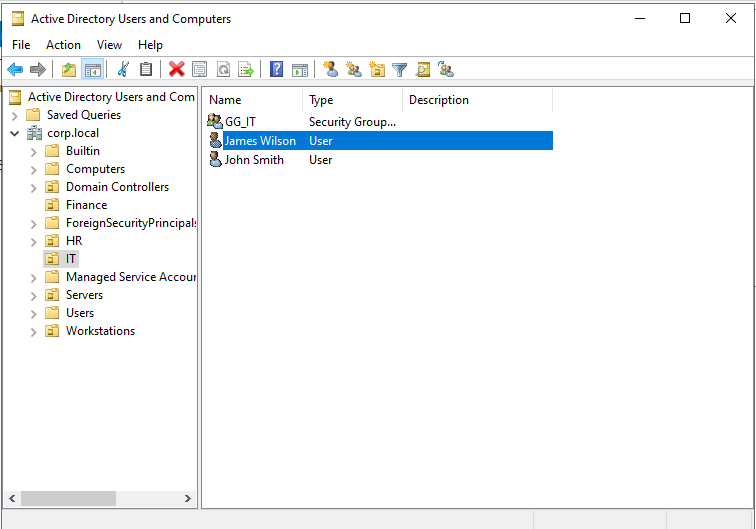
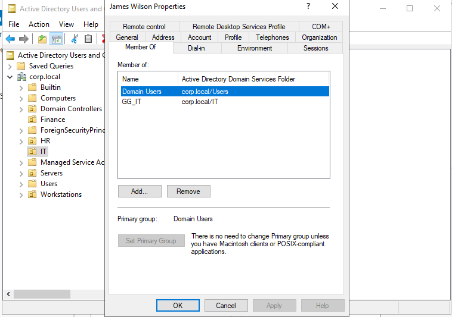
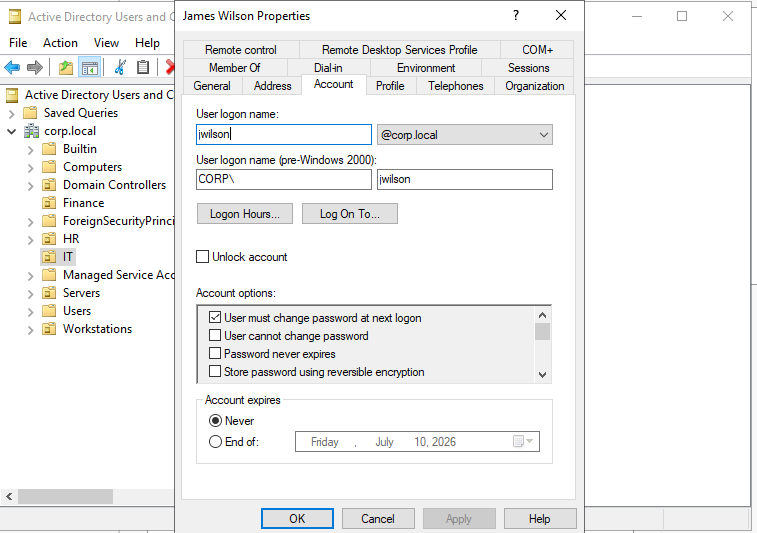
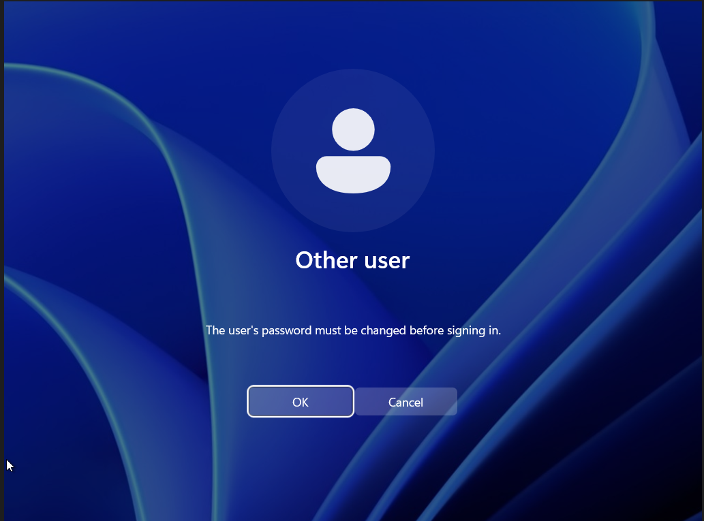
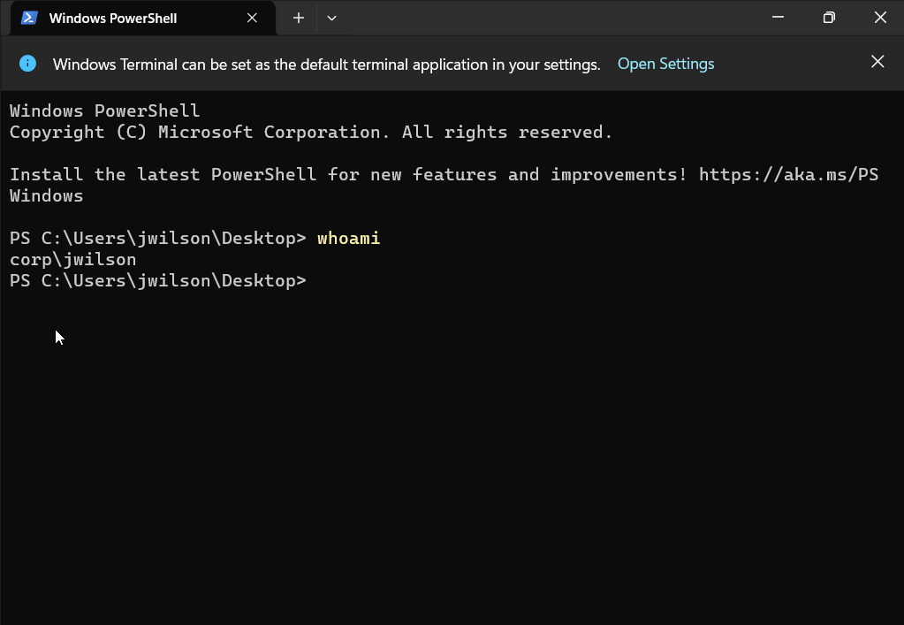

# Ticket 004 - New User Onboarding

## Ticket Information

| Field | Value |
|---------|---------|
| Ticket ID | HD-004 |
| Category | User Management |
| Priority | Medium |
| Status | Resolved |
| Assigned To | IT Support |
| Environment | Active Directory (corp.local) |

---

## Request

HR submitted a request to onboard a new employee joining the IT department.

Employee Details:

```text
Name: James Wilson
Department: IT
Username: jwilson
```

---

## Actions Performed

### Create User Account

Created a new Active Directory user account.

Location:

```text
corp.local/IT
```

User:

```text
James Wilson
```

Username:

```text
jwilson
```

---

### Configure Account

Assigned a temporary password.

Enabled:

```text
User must change password at next logon
```

This ensures the employee creates a unique password during first sign-in.

---

### Assign Department Group

Added user to:

```text
GG_IT
```

This follows role-based access control principles and grants permissions through security groups rather than directly assigning permissions to users.

---

### Verify Group Membership

Confirmed membership:

```text
Domain Users
GG_IT
```

---

### First Login Test

Logged into workstation:

```text
WS01
```

Using:

```text
CORP\jwilson
```

Windows prompted the user to change the temporary password.

Password was successfully changed.

---

### Authentication Verification

Opened PowerShell and executed:

```powershell
whoami
```

Result:

```text
corp\jwilson
```

This confirmed successful domain authentication.

---

## Verification

Successfully verified:

- User account creation
- Security group assignment
- Password change requirement
- First login process
- Domain authentication

---

## Evidence

### New User Created



### Group Membership Assigned



### Password Change Required



### First Login Password Change



### Successful Login Verification



---

## Outcome

The new employee account was successfully provisioned, assigned to the correct department group, and verified through a successful domain login.

No further action required.

---

## Skills Demonstrated

- Active Directory User Management
- User Provisioning
- Security Group Administration
- Account Configuration
- Password Management
- Domain Authentication
- User Onboarding Process
- Helpdesk Documentation