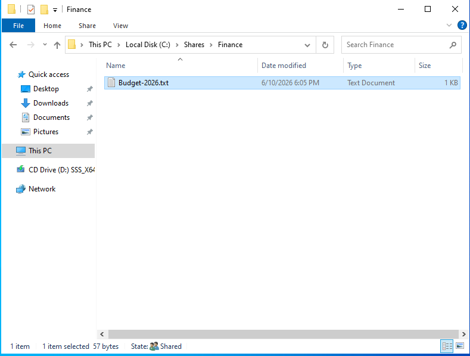
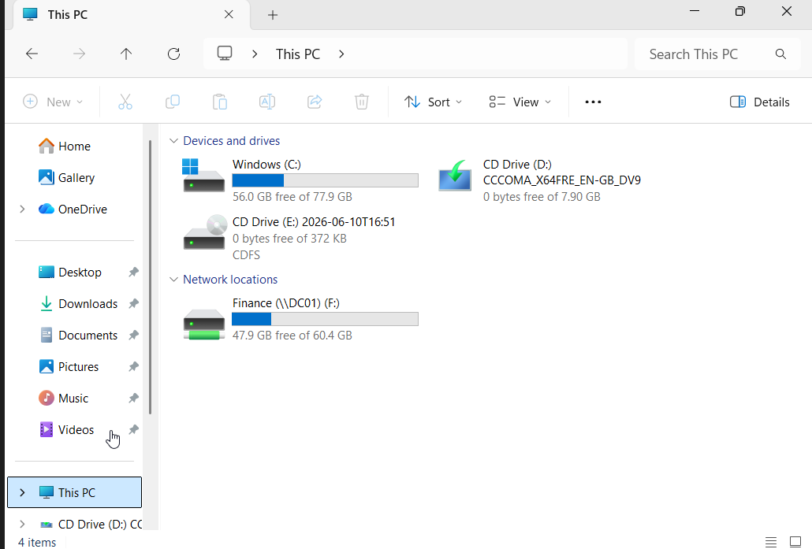

# Ticket 005 - Network Drive Mapping

## Ticket Information

| Field | Value |
|---------|---------|
| Ticket ID | HD-005 |
| Category | File Services |
| Priority | Medium |
| Status | Resolved |
| Assigned To | IT Support |
| Environment | Active Directory (corp.local) |

---

## User Request

Finance department users reported that while they could access the Finance shared folder using a UNC path, they wanted a mapped network drive for easier access.

Requested Share:

\\DC01\Finance

Requested Drive Letter:

F:

---

## Investigation

Verified that the Finance share existed and was accessible.

Location:

C:\Shares\Finance

Verified the presence of a test file:

Budget-2026.txt

Confirmed that Finance users had the appropriate permissions through:

GG_Finance

---

## Resolution

Performed the following actions:

1. Logged into WS01 as Michael Brown.
2. Opened This PC.
3. Selected Map Network Drive.
4. Configured:

Drive Letter:

F:

Folder:

\\DC01\Finance

5. Enabled:

Reconnect at sign-in

6. Completed the mapping process.

---

## Verification

Confirmed that:

- Drive F: appeared under Network Locations.
- Budget-2026.txt was accessible.
- Users could browse the share normally.

Performed an additional test:

1. Signed out of the workstation.
2. Signed back in as Michael Brown.
3. Verified the mapped drive automatically reconnected.

The mapped drive remained available after login.

---

## Evidence

### Finance Test File Created

### Network Drive Mapped

### Persistent Drive Mapping

---

## Outcome

Successfully mapped the Finance shared folder as drive F:.

Users can now access Finance resources through a persistent mapped drive that reconnects automatically after login.

No further action required.

---

## Skills Demonstrated

- Network Drive Mapping
- Windows File Services
- Shared Folder Administration
- Active Directory Access Verification
- User Access Testing
- Workstation Administration
- Helpdesk Documentation