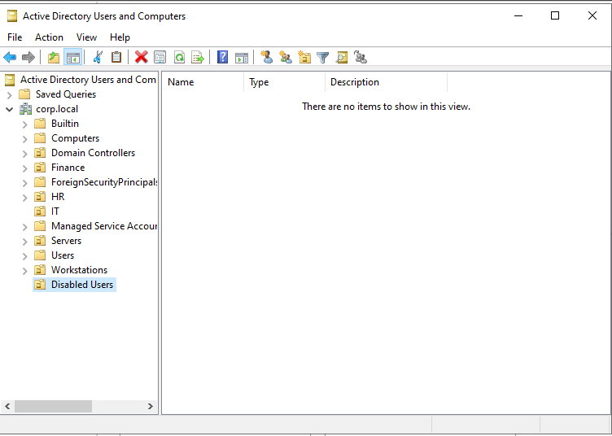
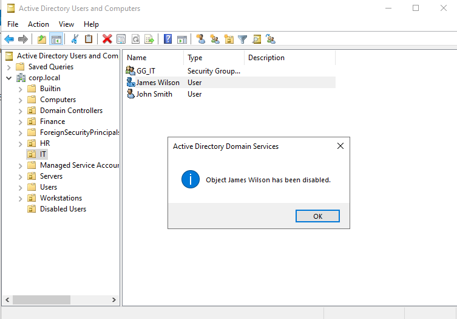
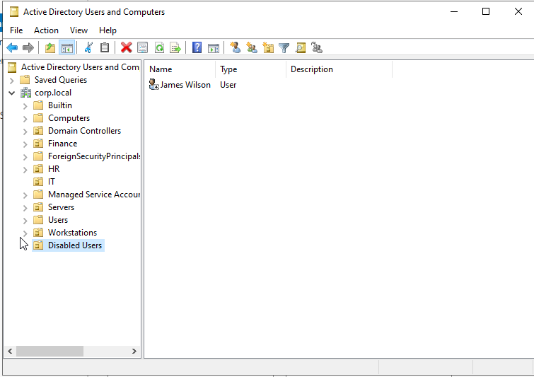
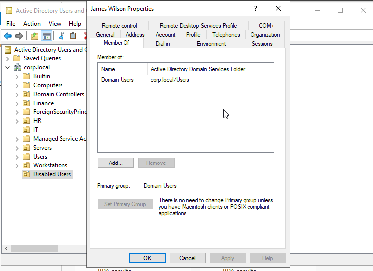
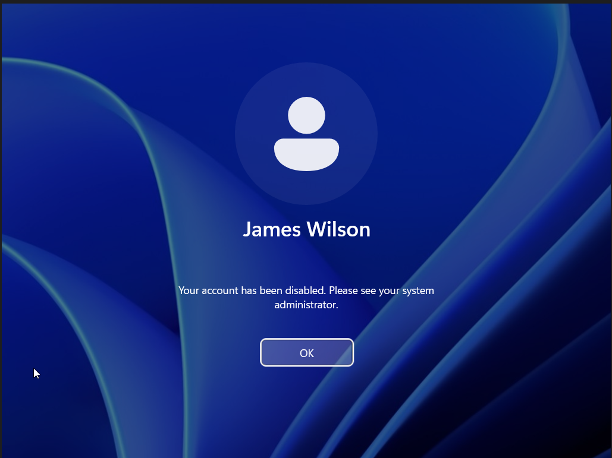

# Ticket 007 - User Offboarding

## Ticket Information

| Field | Value |
|---------|---------|
| Ticket ID | HD-007 |
| Category | User Management |
| Priority | High |
| Status | Resolved |
| Environment | Active Directory (corp.local) |

---

## Request

HR notified IT that employee James Wilson had left the organization.

IT was required to:

- Remove access immediately
- Disable the user account
- Remove department permissions
- Retain the account for auditing purposes

---

## User Information

Name:

James Wilson

Username:

jwilson

Department:

IT

---

## Actions Performed

### Create Disabled Users OU

Created a dedicated Organizational Unit:

```text
Disabled Users
```

Purpose:

- Separate inactive users from active employees
- Simplify auditing and account reviews
- Support retention policies

---

### Disable User Account

Located user:

```text
James Wilson
```

Action:

```text
Disable Account
```

Result:

```text
Object James Wilson has been disabled.
```

---

### Move User to Disabled Users OU

Moved:

```text
James Wilson
```

From:

```text
corp.local/IT
```

To:

```text
corp.local/Disabled Users
```

---

### Remove Department Access

Reviewed group memberships.

Removed:

```text
GG_IT
```

Retained:

```text
Domain Users
```

This removed departmental permissions while preserving account records.

---

## Verification

Attempted login on:

```text
WS01
```

Using:

```text
CORP\jwilson
```

Result:

```text
Your account has been disabled.
Please see your system administrator.
```

Access was successfully blocked.

---

## Evidence

### Disabled Users OU Created



### User Account Disabled



### User Moved to Disabled OU



### Group Membership Removed



### Login Failure Verification



---

## Outcome

Successfully completed employee offboarding process.

Actions completed:

- Account disabled
- User moved to Disabled Users OU
- Department group membership removed
- Login access blocked

No further action required.

---

## Skills Demonstrated

- Active Directory Administration
- User Offboarding
- Organizational Unit Management
- Security Group Administration
- Access Revocation
- Identity and Access Management (IAM)
- Helpdesk Operations
- Security Best Practices