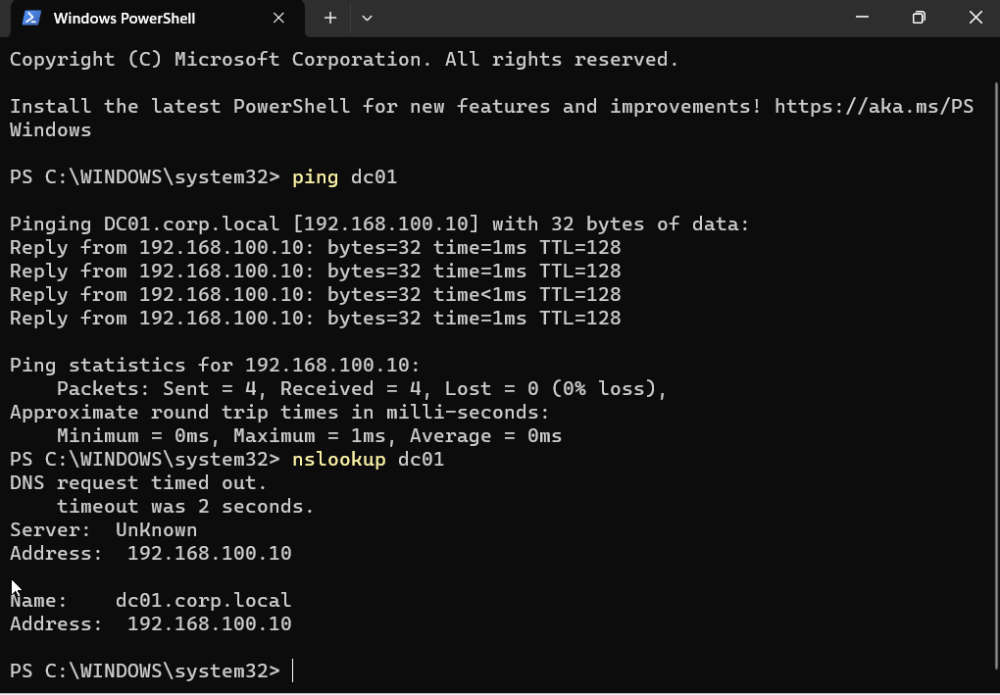
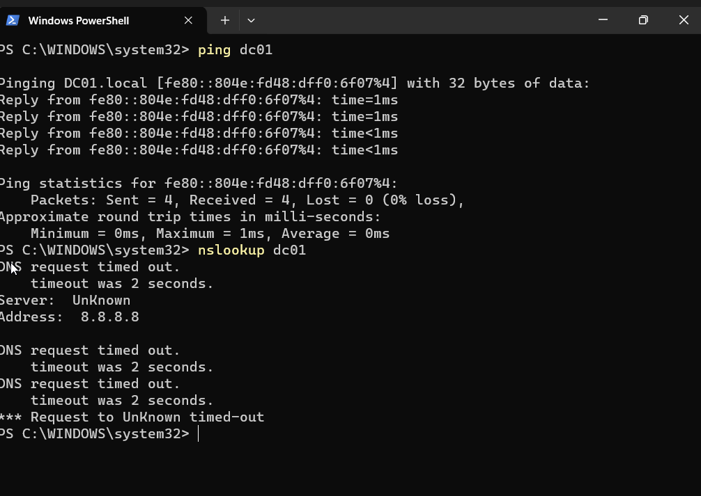
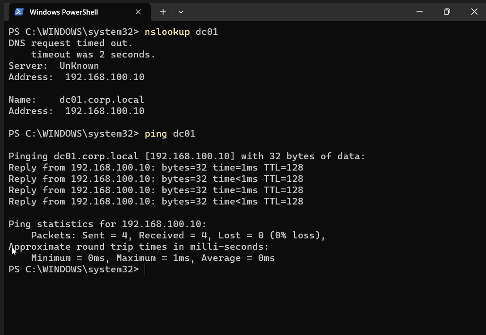

# Ticket 008 - DNS Troubleshooting

## Ticket Information

| Field       | Value                         |
| ----------- | ----------------------------- |
| Ticket ID   | HD-008                        |
| Category    | DNS                           |
| Priority    | Medium                        |
| Status      | Resolved                      |
| Environment | Active Directory (corp.local) |

---

## Issue

User reported inability to access internal resources using hostnames.

Examples:

* Unable to resolve DC01
* Internal DNS queries failing
* Domain resources inaccessible

---

## Investigation

### Baseline Testing

Executed:

ping dc01

Result:

Hostname successfully resolved to:

192.168.100.10

Executed:

nslookup dc01

Result:

dc01.corp.local resolved successfully.

---

### Reproducing the Issue

Modified workstation DNS configuration.

Changed DNS Server:

192.168.100.10

To:

8.8.8.8

Result:

nslookup dc01 failed.

Hostname resolution for internal resources became unavailable.

---

### Root Cause Analysis

Executed:

ipconfig /all

Finding:

DNS Server configured as:

8.8.8.8

Google Public DNS does not contain Active Directory records for:

* corp.local
* dc01.corp.local
* Active Directory SRV records

Root cause identified as incorrect DNS server configuration.

---

## Resolution

Restored DNS configuration.

Changed DNS Server back to:

192.168.100.10

Executed:

ipconfig /flushdns

Executed:

nslookup dc01

Result:

dc01.corp.local resolved successfully.

Executed:

ping dc01

Result:

Successful communication with:

192.168.100.10

---

## Verification

Verified:

* DNS resolution restored
* Hostname lookup successful
* Internal resources accessible

---

## Evidence

### DNS Working Before Issue

Demonstrates successful hostname resolution prior to introducing the fault.

---

### DNS Failure Reproduced

Demonstrates failure after changing the workstation DNS server to 8.8.8.8.

---

### DNS Investigation

Shows workstation configured with incorrect DNS server:

8.8.8.8

---

### DNS Issue Resolved

Demonstrates successful restoration of DNS services after correcting the DNS server configuration.

---

## Skills Demonstrated

* DNS Troubleshooting
* Active Directory DNS
* Network Diagnostics
* Root Cause Analysis
* Windows Networking
* PowerShell Troubleshooting
* Helpdesk Operations

---

## Outcome

Issue resolved successfully.

Workstation DNS configuration restored and internal name resolution functioning normally.
