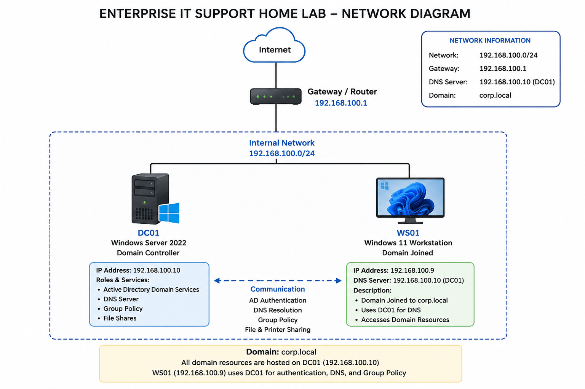
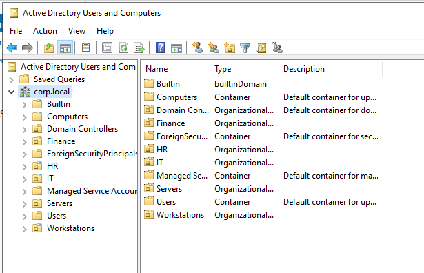
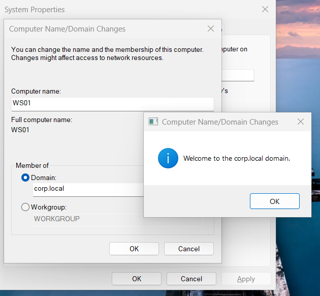
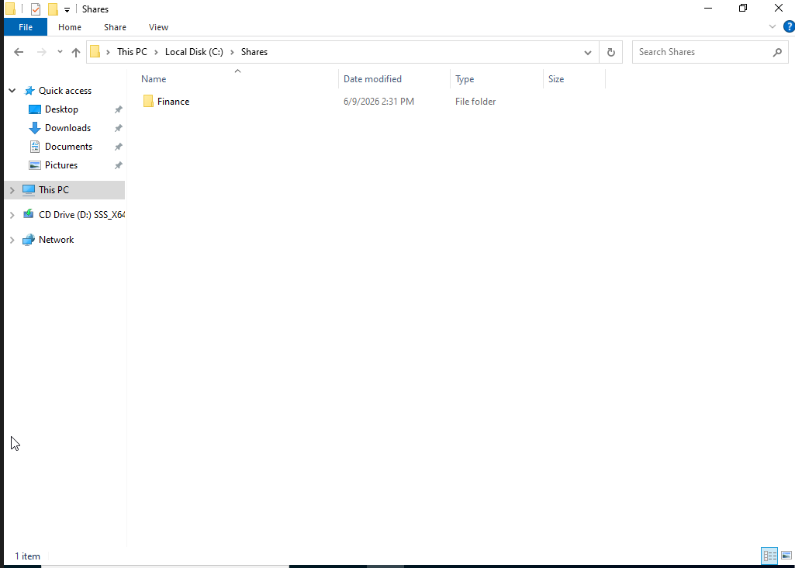
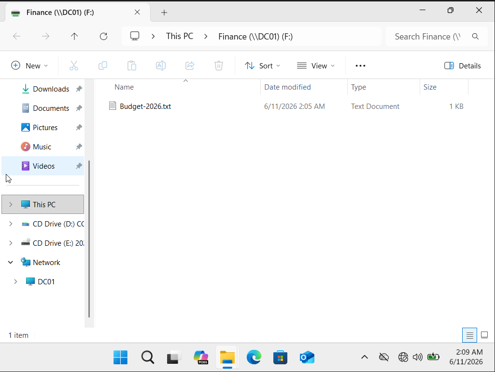
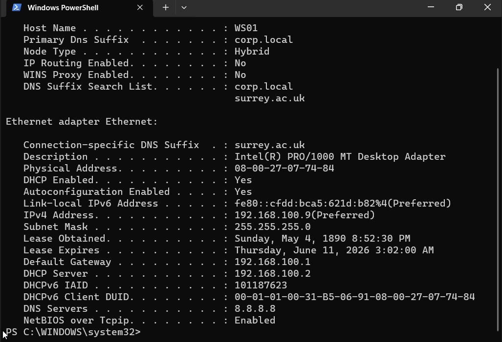

# Enterprise IT Support Home Lab

## Overview

This project simulates a small enterprise IT environment using Windows Server 2022 and Windows 11.

The goal was to gain hands-on experience with common IT Support, Service Desk, and Junior System Administrator responsibilities by building and managing an Active Directory domain from scratch.

The lab includes:

- Active Directory Domain Services
- DNS Management and Troubleshooting
- Group Policy Administration
- User Onboarding and Offboarding
- Password Management
- Shared Folder Permissions
- Network Drive Mapping
- Security Group Management
- Windows Troubleshooting
- Helpdesk Ticket Documentation

---

## Lab Environment

### Infrastructure

| Component | Details |
|------------|------------|
| Server OS | Windows Server 2022 |
| Client OS | Windows 11 |
| Domain | corp.local |
| Domain Controller | DC01 |
| Workstation | WS01 |
| Services | Active Directory, DNS, Group Policy, File Sharing |

---

## Network Diagram

The lab consists of a Windows Server 2022 Domain Controller and a Windows 11 workstation connected within the same internal network.



### Network Details

| Device | Role | IP Address |
|----------|----------|----------|
| DC01 | Domain Controller, DNS Server, File Server | 192.168.100.10 |
| WS01 | Domain-Joined Windows 11 Workstation | 192.168.100.9 |
| Gateway | Router | 192.168.100.1 |

### Services Hosted on DC01

- Active Directory Domain Services (AD DS)
- DNS Server
- Group Policy Management
- Shared Folder Services
- User Authentication

### Domain Information

| Setting | Value |
|----------|----------|
| Domain Name | corp.local |
| DNS Server | 192.168.100.10 |
| Network Range | 192.168.100.0/24 |

---

## Skills Demonstrated

### Active Directory Administration

- Domain deployment
- User account management
- Organizational Unit management
- Security group administration
- Account lockout resolution
- Password resets

### Identity and Access Management

- User onboarding
- User offboarding
- Group membership management
- Access control implementation

### File Services

- Shared folder creation
- NTFS permissions
- Share permissions
- Network drive mapping

### Group Policy

- Password policy configuration
- Security policy enforcement
- Policy deployment and verification

### DNS

- DNS troubleshooting
- Name resolution analysis
- DNS client configuration
- Root cause analysis

### Helpdesk Operations

- Incident investigation
- Troubleshooting workflows
- Documentation
- Ticket resolution

---

## Helpdesk Tickets Completed

| Ticket ID | Description |
|------------|------------|
| HD-001 | Account Lockout Resolution |
| HD-002 | Password Reset Request |
| HD-003 | Shared Folder Access Issue |
| HD-004 | New User Onboarding |
| HD-005 | Network Drive Mapping |
| HD-006 | Password Policy Enforcement |
| HD-007 | User Offboarding |
| HD-008 | DNS Troubleshooting |

---

## Project Structure

```text
Enterprise-IT-Support-Home-Lab/
│
├── Active-Directory/
├── DNS/
├── Group-Policy/
├── Helpdesk-Tickets/
├── Troubleshooting/
├── User-Management/
├── Workstations/
├── Documentation/
│   └── Screenshots/
└── README.md
```

---

## Key Screenshots

### Active Directory Structure



### Domain Join Verification



### Shared Finance Department Folder



### Network Drive Mapping



### Password Policy Enforcement


### DNS Troubleshooting



### User Offboarding


### Disabled Account Verification


---

## What I Learned

Through this project I gained practical experience with:

- Active Directory administration
- Windows Server management
- DNS troubleshooting
- Group Policy configuration
- Access control and permissions
- User lifecycle management
- Enterprise IT documentation
- Structured troubleshooting methodologies

---

## Future Improvements

Potential future additions include:

- Group Policy troubleshooting scenarios
- DHCP deployment
- Windows Server backup and recovery
- Event Viewer investigations
- PowerShell automation
- Security monitoring and auditing

---

## Author

Meet Dave

MSc Cyber Security – University of Surrey

CompTIA Security+

Aspiring IT Support / System Administration / Cyber Security Professional