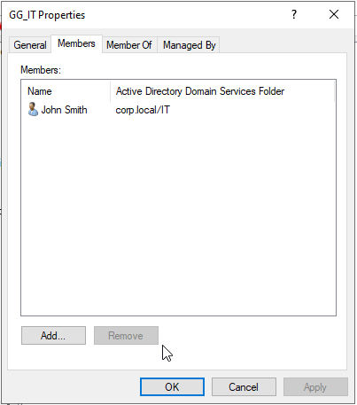
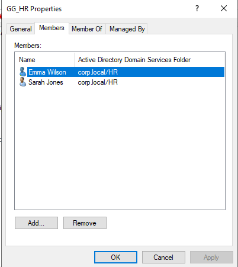
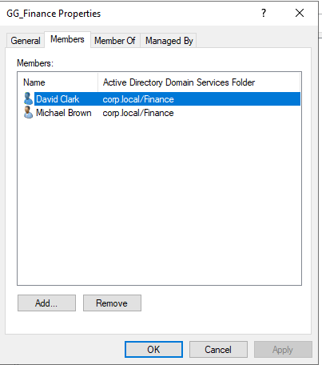

# Security Group Management

## Objective

Implement role-based access control using Active Directory security groups.

---

## Security Groups Created

| Group Name | Department |
|------------|------------|
| GG_IT | IT |
| GG_HR | HR |
| GG_FINANCE | Finance |

---

## Membership Configuration

### GG_IT

- John Smith (jsmith)

### GG_HR

- Sarah Jones (sjones)
- Emma Wilson (ewilson)

### GG_FINANCE

- Michael Brown (mbrown)
- David Clark (dclark)

---

## Purpose

Security groups provide a scalable and manageable way to assign permissions to users.

Instead of assigning permissions directly to user accounts, permissions can be assigned to groups and inherited by members of those groups.

---

## Evidence

### GG_IT Membership

### GG_HR Membership

### GG_FINANCE Membership

---

## Outcome

Department-based security groups were created and users were assigned appropriately. This establishes the foundation for access control, shared resources, and permission management.

---

## Skills Demonstrated

- Active Directory Group Administration
- Role-Based Access Control (RBAC)
- Identity and Access Management
- User Administration
- Windows Server Administration