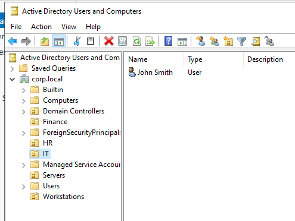
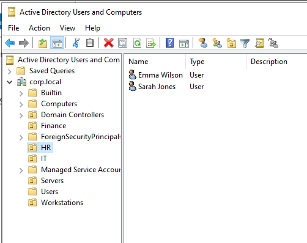
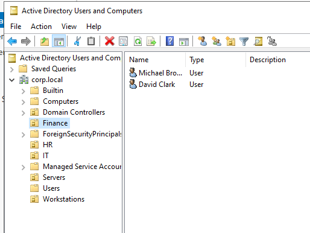

# User Provisioning

## Objective

Create employee accounts within Active Directory and assign them to the appropriate departmental Organizational Units (OUs).

---

## Users Created

| Full Name | Username | Department |
|------------|------------|------------|
| John Smith | jsmith | IT |
| Sarah Jones | sjones | HR |
| Emma Wilson | ewilson | HR |
| Michael Brown | mbrown | Finance |
| David Clark | dclark | Finance |

---

## Activities Performed

- Created user accounts within Active Directory
- Assigned users to departmental OUs
- Configured initial passwords
- Enabled "User must change password at next logon"
- Verified successful account creation

---

## Organizational Placement

### IT Department

- John Smith

### HR Department

- Sarah Jones
- Emma Wilson

### Finance Department

- Michael Brown
- David Clark

---

## Evidence

### IT Users

### HR Users

### Finance Users

---

## Outcome

Departmental user accounts were successfully provisioned and organized within Active Directory. This provides the foundation for authentication, access management, group administration, and helpdesk support scenarios.

---

## Skills Demonstrated

- Active Directory User Administration
- Identity Management
- User Provisioning
- Windows Server Administration
- Access Management
- Enterprise Directory Services