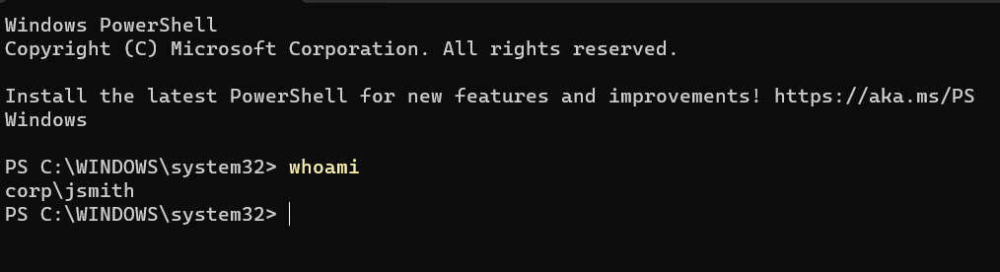

# Workstation Domain Join

## Objective

Join a Windows 11 Pro workstation to the Active Directory domain and verify domain authentication.

---

## Workstation Information

| Setting | Value |
|----------|----------|
| Computer Name | WS01 |
| Operating System | Windows 11 Pro |
| Domain | corp.local |

---

## Activities Performed

- Configured workstation network connectivity
- Configured DNS to use the Domain Controller
- Verified DNS resolution for the Active Directory domain
- Joined WS01 to the corp.local domain
- Restarted the workstation
- Verified successful domain authentication

---

## Verification

Executed:

```powershell
whoami
```

Output:

```text
corp\jsmith
```

---

## Evidence

### Successful Domain Join


### Domain Authentication Verification



---

## Outcome

The workstation was successfully joined to the Active Directory domain and authenticated using domain credentials.